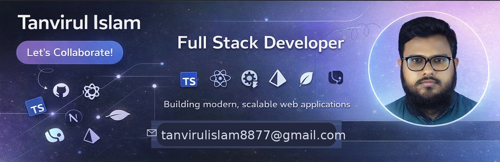

## Hi 👋, I'm Tanvirul Islam 

- 🔭 I’m currently working on React.js, Next.js, typescript and React Query for frontend.
- ⚙️ Using Node.js, Express.js, prisma, postgresql
- 🌱 I’m currently learning ...
- 👯 I’m looking to collaborate on ...
- 🤔 I’m looking for help with ...
- 💬 Ask me about ...
- 📫 How to reach me: ...
- 😄 Pronouns: ...
- ⚡ Fun fact: ...

## 🌐 Socials:
   

# 💻 Tech Stack:
                               
# 📊 GitHub Stats:
 
 

## 🏆 GitHub Trophies

### ✍️ Random Dev Quote

### 🔝 Top Contributed Repo

---

<!-- Proudly created with GPRM ( https://gprm.itsvg.in ) -->
